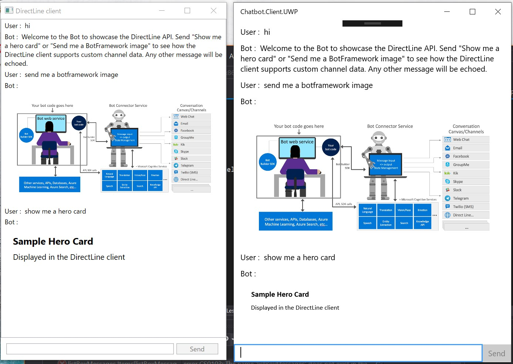

# How to run this sample.

## Create a bot

- SignIn to Azure portal
- Create a Web Apps and a Bot Channels Registration
- Add DirectLine channel to the Bot Channels Registration, and copy the key.
- Edit a DirectBot.bot file at the Chatbot.Server project like below:

```json
{
  "name": "DirectBot",
  "description": "",
  "services": [
    {
      "type": "endpoint",
      "name": "development",
      "appId": "",
      "appPassword": "",
      "endpoint": "http://localhost:4082/api/messages",
      "id": "155"
    },
    {
      "type": "endpoint",
      "name": "production",
      "appId": "your bot's app id",
      "appPassword": "your bot's app secret",
      "endpoint": "https://yourwebappname.azurewebsites.net/api/messages",
      "id": "135"
    }
  ],
  "padlock": "",
  "version": "2.0"
}
```

- Deploy Chatbot.Server project to Azure Web Apps you created.

## WPF

The WPF app is created on .NET Core 3.0. You have to use Visual Studio 2019 and preview version .NET Core 3.0.

- Edit appsettings.json like below:

```json
{
  "DirectLine": {
    "BotId": "yourbotname",
    "Key": "Key of DirectLine channel"
  }
}
```

- Run the app

## UWP

- Edit appsettings.json like below:

```json
{
  "DirectLine": {
    "BotId": "yourbotname",
    "Key": "Key of DirectLine channel"
  }
}
```

- Run the app


## Screenshots


